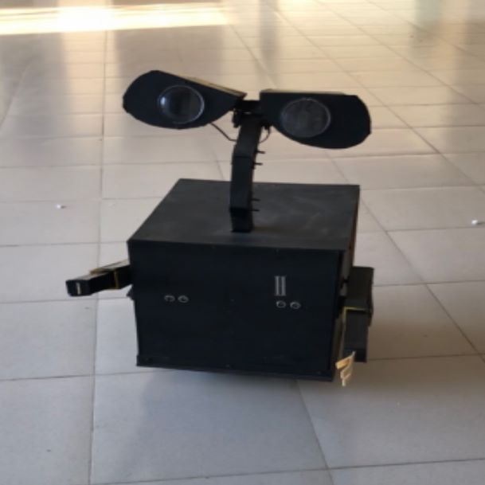
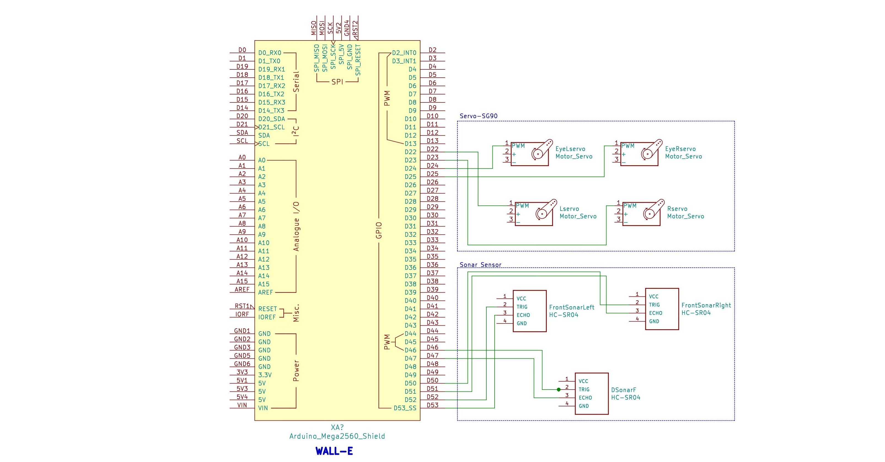

# Wall-E

Wall-E is a fun little robot that uses sonar sensor to roam around randomly and avoid obstacle.

## 💻 Tech Spec

## 🛠 Components Used

- Arduino Mega
- 3 x Sonar
- 4 x Servo Motor (SG-90)
- 12V Lipo Battery
- Buck Module
## 🚀 How to Start

Upload the **WALL_E.ino** file to Arduino Mega

## 🖍📐 Schematics

## 🏆 Contributors 

|      Name 🎖️    |     Social Media 👋    | GitHub     :octocat: |
|:-------------:|:-------------------|------------------|
| Shihab Anik |  :mortar_board: [LinkedIn](https://www.linkedin.com/in/md-anik-hossain-b7b860148/?fbclid=IwAR1lcZziJsXVxuFxJQe3GMvL59DiOdPIr9IhTC95M-O9kp8gTo3NJN_f1cY) | [Shihab Anik](https://github.com/anikhossain-285?tab=projects&fbclid=IwAR3NDPk5X4vdkD-UkkGcavSaqXw2d2xa6J8APHpMxd3RK2ojZgItQtUXQXM)  |
| Muntasir Mahdi       | :mortar_board: [LinkedIn](https://www.linkedin.com/in/muntasir-mahdi/?fbclid=IwAR19woK36Uci73IDzzuAN_NzBrPP4UpUuA5Vw7hwJyP7Y2Gnv_kH7hpokQM) |       |
| Ariful Haque Himu  |  :mortar_board: [LinkedIn](https://www.linkedin.com/in/ariful-himu-b5b72b146/?fbclid=IwAR3jUBujBbTY4kNan5nPS6mo3Hjto6eMi8eluyphpYR1A3Z2EClsNhEgDmE) |       |
|  Minhaz Muhtasim  |  :mortar_board: [LinkedIn](https://www.linkedin.com/in/minhaj-m-m/?fbclid=IwAR0_A6so1TXNwzoSMwGvKwm85tw9MYHRe588SkmnCfDhqRxpcq72xHPymgU) |       |
